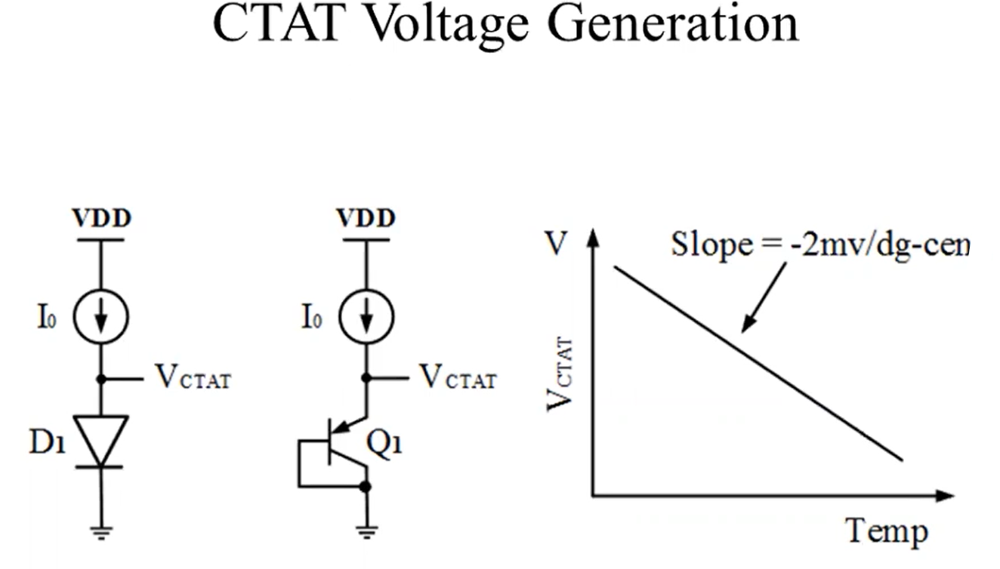

# Bandgap IP Design using Sky130 technology node

A 2 day cloud based virtual training workshop conducted by VSD-IAT from 20th to 21st November, 2021. The link to the workshop webpage can be found [here](https://www.vlsisystemdesign.com/bandgap-ip-design-using-sky130-technology-node/). Below is a brief, day-wise documentation about the topics covered in the course, along with my implementations of the lab sessions.

## Table of Contents

  * [Day 1 - Bandgap Design Theory](#day-1---bandgap-design-theory)
    + [Introduction to Bandgap Voltage Reference](#introduction-to-bandgap-voltage-reference)
    + [CTAT Voltage Generation Circuit](#ctat-voltage-generation-circuit)
    + [PTAT Voltage Generation Circuit](#ptat-voltage-generation-circuit)
    + [Self-Biased Current Mirror Circuit](#self-biased-current-mirror-circuit)
  * [Day 2](#)
    + 
  * [Acknowledgements](#acknowledgements)

## Day 1 - Bandgap Design Theory

Integrated circuits or System on Chip (SoC) generally contain many analog and digital subsystems requiring various regulated supply voltages. These supply voltages are provided by linear voltage regulators such as LDOs. The LDOs, as well as some subcircuits like ADCs or DACs, need a reference voltage input that must be independent to variations in process, voltage and temperature. Typical power supplies can create noisy/rippled outputs, or may have their voltage drop over time like batteries. A Process-Voltage-Temperature Independent Biasing Circuit is used to provide this reference voltage, with typical values as follows:
 + Typical Temperature Coefficient = 10 to 50 ppm/°C (~ 10 to 50 uV/°C for <i>VREF</i> = 1V)
 + Typical Power Supply Rejection Ratio = 40 to 60 dB (10-1 mV/V)

Similarly, this PVT independent biasing circuit can be used to provide reference currents as well to the various subsystems.

Some methods to generate reference voltages are as follows:

1. **Voltage Divider Circuit** - Good temperature coefficient, but undesirable power supply sensitivity
2. **Forward-Biased PN Junction** - Worse temperature coefficient (~3142 ppm/°C), but better power supply sensitivity than a voltage divider
3. **Base-Emitter Voltage Referenced Circuit** - Good supply rejection due to the use of current mirror circuit, but undesirable temperature coefficient (~2333 ppm/°C)
4. **Bandgap Voltage Reference Circuit** - Great temperature coefficient (~10-50 ppm/°C) and power supply sensitivity

### Introduction to Bandgap Voltage Reference

A bandgap voltage reference (BGR) circuit works on the principle that equally adding 2 voltages, one with a negative temperature coefficient and one with a positive temperature coefficient, should give a voltage reference that is independent to variations in temperature. In practice however, it is generally in the range of 10 to 50 ppm/°C. This is shown below.

 

Some applications of a BGR are listed below:
- Low Dropout Regulator (LDO)
- DC-to-DC Buck Converter
- Analog-to-Digital Converter (ADC)
- Digital-to-Analog Converter (DAC)

**Types of BGR:**
- Based on Architecture
  1. Using Self-Biased Current Mirror
  2. Using Operational-Amplifier
- Based on Application
  1. Low-Voltage BGR
  2. Low-Power BGR
  3. High PSRR and Low-Noise BGR
  4. Curvature Compensated BGR

**Self-Biased Current Mirror based BGR**

This is the topology that will be designed during the course of this workshop. It has the following advantages:
- Simplest topology
- Easy to design
- Always stable

Some limitations for this design are as follows:
- Low power supply rejection ratio (PSRR)
- Cascode design needed to reduce PSRR
- Voltage head-room issue
- Needs a start-up circuit

The following components are required to develop a BGR:
- CTAT voltage generation circuit
- PTAT voltage generation circuit
- Self-biased current mirror circuit
- Reference branch circuit
- Start-up circuit

### CTAT Voltage Generation Circuit

Diodes have a negative temperature coefficient, but we make use of a BJT as a diode by shorting the base and collector (for PNP diode). This is because diodes have their P substrate connected to GND in a SoC, which is an invalid configuration for a CTAT circuit. This is shown below.

A regular BJT used in diode configuration as shown in (b) can cause a parasitic BJT to be formed, making it unusable for the CTAT circuit. Hence, we make use of the structure in figure (c) as a BJT in diode configuration to generate the CTAT voltage.

We can now design the CTAT circuit as shown below, and further analyse its temperature coefficient as shown.

The figure below shows how variations in the CTAT circuit design affect its temperature coefficient.

Here, figure (b) shows that adding more BJT units further increases the negative slope for VCTAT vs. temperature for the circuit. We can also alter the slope by changing the current through the BJT, as shown in figure (c). As we decrease the current through the BJT, the slope increases negatively.

### PTAT Voltage Generation Circuit

A PTAT voltage generation circuit uses multiple BJTs in diode configuration to create a voltage with positive temperaure coefficient. Its working principle is shown in the figure below.

Here, Q1 is a single BJT, while Q2 has multiple BJTs in parallel in the ratio 1:N to Q1. We can further analyse the voltages V and V1 as follows.

We can see above that V1 has a more negative slope than V, as it has N BJTs connected in parallel. This causes the current to be divided, leading to lower current through each BJT. Now, if we take the difference of the voltages V and V1, we get a voltage with a positive slope versus temperature.

**Design of Resistor R1**

We must also design the value of the resistor R1 according to the power consumption specifications and silicon area budget. An increase in resistance value will cause increased silicon area, but lower current. The value of the resistance also depends on the number of BJTs used. The equation to calculate R1 is given below.

R1 = Vt &sdot; ln (N)/I

<!--- --->

### Self-Biased Current Mirror Circuit

In a PTAT generation circuit, we make use of a self-biased current mirror to ensure that the node voltages and currents are the same. A current mirror allows us to establish a DC voltage or current that is independent of supply and process, with a well-defined behaviour with temperature. A simple current mirror is shown below.

The issue with a simple current mirror is that the output current is very sensitive to *VDD*. We can also use a resistor R1 like shown in the figure. This, however, will allow variations in the current with changes in temperature, as resistors are temperature dependent. For a less sensitive solution, we must use a circuit that biases itself. This means *IREF* must be somehow derived from *IOUT*.

The figure above shows a self-biased current mirror. The idea of self-biasing is that if *IOUT* can be independent of *VDD*, then *IREF* can be a replica of *IOUT*. Here, MP1 and MP2 copy *IOUT* and define *IREF*, meaning *IREF* is bootstrapped to *IOUT*. Since each diode-connected device feeds from a current source, *IOUT* and *IREF* are ultimately independent of *VDD*.

In this circuit however, the currents are given by the equation IOUT = K &sdot; IREF and cannot be uniquely defined.

## Acknowledgements

- [Kunal Ghosh](https://github.com/kunalg123)
- [VSD-IAT](https://vsdiat.com/)
